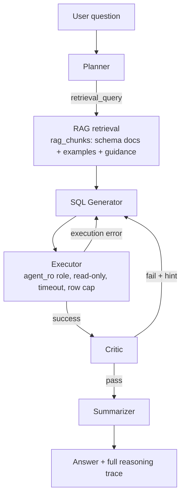

# Autonomous Data-Analyst Agent

A multi-agent system that answers natural-language questions about ride-sharing data by
**planning → retrieving schema context (RAG) → generating SQL → executing it read-only →
critiquing its own result → retrying if wrong → summarizing**, and returns the full
reasoning trace alongside the answer. Built as a placement-season portfolio project to
demonstrate agentic system design, GenAI/RAG grounding, and backend engineering under
real constraints (free-tier hosting, rate limits, no background workers) — not a toy demo.

**Contents:** [Relationship to the other project](#relationship-to-the-ride-sharing-analytics-platform)
· [Architecture](#architecture) · [Quickstart](#quickstart-local-development) ·
[Deployment](#deployment) · [Design decisions & tradeoffs](#design-decisions--tradeoffs) ·
[Testing](#testing) · [Known limitations](#known-limitations)

## Relationship to the Ride-Sharing Analytics Platform

This project reasons over a **one-time Postgres snapshot** exported from the Gold layer of
my [Real-Time Ride-Sharing Analytics Platform](https://github.com/MadhavKamble/realtime-rideshare-pipeline)
(Kafka → Delta Lake → Airflow → Streamlit). The two systems are deliberately decoupled: the agent
has no runtime dependency on Delta Lake, Spark, or Kafka, and either project can run,
deploy, or fail independently. The only bridge is `scripts/export_from_delta.py`, a
manually-run utility — see [Why a Postgres snapshot instead of live Delta
access](#3-why-a-postgres-snapshot-instead-of-live-delta-access) for the reasoning.

## Architecture



The loop from SQL Generator to Critic is bounded: at most 3 SQL attempts, and a hard cap
of 8 LLM calls total for the whole question (1 planner + 3×(generator + critic) + 1
summarizer). Both bounds are enforced by the orchestrator (`app/orchestrator/pipeline.py`),
not by convention.

### The agents

Each agent is a separate module (`app/agents/`) with its own prompt template
(`app/prompts/*.txt`) and a pydantic output model (`app/agents/schemas.py`) — no agent
returns free text that something downstream has to regex apart.

| Agent | Input | Output | Notes |
|---|---|---|---|
| **Planner** | the question | `steps`, `tables`, `retrieval_query` | Decides what schema context to fetch — the *planner's* query drives retrieval, not the raw question. |
| **RAG retrieval** | `retrieval_query` | top-k `rag_chunks` | Schema docs, curated NL→SQL examples, and standing guidance. See [RAG design](#rag-one-corpus-two-retrievers) below. |
| **SQL Generator** | question, plan, retrieved chunks, (retry feedback) | one PostgreSQL query | Grounded strictly in retrieved context; never sees the full schema. |
| **Executor** | SQL | rows, or a clean error | Runs as `agent_ro` — see [SQL safety](#2-how-bad-or-injected-sql-from-a-hallucinating-model-is-prevented). |
| **Critic** | question, SQL, result | `pass`/`fail` + issues + hint | Judges shape and semantics (e.g. did it filter `status = 'completed'` before averaging fares), not just "did it error." |
| **Summarizer** | question, SQL, result | plain-English answer + caveats | Only ever sees data that already passed the critic; states only what's in the result. |

### Repo layout

```
backend/app/
  agents/        planner, sql_generator, critic, summarizer + schemas.py (typed outputs)
  prompts/       one .txt template per agent (system/user split, string.Template)
  rag/           embeddings.py (Ollama), retriever.py (vector + lexical), corpus/*.yaml
  llm/           client.py (protocol), groq_client.py (backoff/retry), ollama_client.py
  db/            engine.py (pools), executor.py, guardrails.py (sqlglot), sessions.py
  orchestrator/  pipeline.py (the bounded loop), trace.py (the /ask response contract)
  api/           routes.py, schemas.py, rate_limit.py
backend/tests/   67 pytest tests — see Testing
db/migrations/   001 data tables, 002 read-only role, 003 sessions, 004 rag_chunks
db/seed/         deterministic mock-data generator (no Delta Lake needed)
scripts/         run_migrations, seed helpers, build_rag_index, export_from_delta,
                 set_agent_password
frontend/src/    Vite + React 19 + TypeScript (strict) chat UI + reasoning-trace panel
```

## Quickstart (local development)

```bash
# 1. Local Postgres 16 + pgvector (host port 5433, avoids clashing with other stacks)
docker compose up -d

# 2. Python env (plain venv works too: python3 -m venv .venv && pip install -e '.[dev]')
cd backend && uv sync --extra dev && cp .env.example .env && cd ..

# 3. Apply migrations, then load realistic mock data (no Delta Lake needed)
uv run --project backend python scripts/run_migrations.py
uv run --project backend python db/seed/seed_mock_data.py

# 4. Provision the read-only role's login (grants live in migration 002;
#    the password deliberately does not)
AGENT_RO_PASSWORD=agent_local_pw uv run --project backend python scripts/set_agent_password.py

# 5. Build the RAG index (embeds via local Ollama; add --skip-embeddings to
#    index for lexical retrieval only)
uv run --project backend python scripts/build_rag_index.py

# 6. Run the API (uses LLM_BACKEND from backend/.env — set to groq with a
#    console.groq.com key, or ollama for fully offline dev)
cd backend && uv run uvicorn app.main:app --reload --port 8000
# then: curl localhost:8000/health
#       curl -X POST localhost:8000/ask -H 'Content-Type: application/json' \
#            -d '{"question": "Which zones generated the most revenue in June 2026?"}'
```

To load **real** data instead of mock data, run the export utility against the other
project's Gold tables (requires the `export` extra):

```bash
cd backend && uv sync --extra export && cd ..
uv run --project backend python scripts/export_from_delta.py \
  --rides-historical        /path/to/gold/rides_historical_nyc \
  --zone-demand-historical  /path/to/gold/zone_demand_historical_nyc \
  --zone-demand             /path/to/gold/zone_demand
```

### Frontend

```bash
cd frontend
npm install
cp .env.example .env   # VITE_API_BASE_URL, defaults to http://localhost:8000
npm run dev            # http://localhost:5173, expects the backend already running
```

`npm run build` runs a strict `tsc -b` before bundling — the reasoning-trace payload
(`AskResult`, per-attempt SQL/execution/critic data, LLM budget counters) is typed
end-to-end in `src/types/trace.ts`, mirrored field-for-field from the backend's pydantic
models, with no `any` in the request path.

## Deployment

The stack targets three free tiers: **Neon** (Postgres), **Render** (FastAPI backend),
**Vercel** (React frontend).

1. **Neon** — create a project, copy the pooled connection string. Run the same
   Quickstart steps 3–5 against it (`--database-url` or `ADMIN_DATABASE_URL` pointed at
   Neon instead of `localhost:5433`). Build the RAG index once from a machine that can
   reach your local Ollama — the deployed backend itself won't be able to (see below).
2. **Render** — new Web Service from this repo, root directory `backend/`. Build command
   `pip install -e .`, start command `uvicorn app.main:app --host 0.0.0.0 --port $PORT`.
   Environment variables: `ADMIN_DATABASE_URL` / `AGENT_DATABASE_URL` (Neon), `GROQ_API_KEY`,
   `LLM_BACKEND=groq`, **`RETRIEVER=lexical`** (Render can't reach a local Ollama instance,
   so the deployed backend ranks the same `rag_chunks` corpus with Postgres full-text
   search instead of embeddings — see [RAG design](#rag-one-corpus-two-retrievers)),
   `CORS_ORIGINS` set to the Vercel URL, `RATE_LIMIT_PER_MINUTE`.
3. **Vercel** — import `frontend/` as the project root, set `VITE_API_BASE_URL` to the
   Render service URL, deploy.

### Keeping the Render free tier warm during demos

Render's free tier spins a service down after ~15 minutes without traffic, and the next
request eats a 30–60 second cold start — exactly what you don't want mid-interview. The
zero-cost fix: create a free [UptimeRobot](https://uptimerobot.com) HTTP(S) monitor
pointed at `https://<your-service>.onrender.com/health` with the default **5-minute
interval**. Each ping counts as traffic, so the service never reaches Render's idle
threshold and stays warm around the clock. Two honest caveats: (1) Render's free tier
includes 750 instance-hours/month and an always-warm service consumes ~730 of them, so
this budget covers exactly **one** service — don't try to keep two warm; (2) this
sidesteps the cold-start problem rather than solving it, so the frontend still detects
in-progress cold starts and shows a "waking up the agent service" message for the case
where the monitor is off or a ping was missed. Pause the monitor outside placement season
to keep usage well under the cap.

## Design decisions & tradeoffs

### 1. Why a fixed pipeline instead of an autonomous tool-choosing agent

Because the tool space here is exactly **one tool**: execute read-only SQL against a
fixed, three-table schema. An autonomous agent earns its keep when the tool space is
large and changes at runtime — a coding agent choosing between a file editor, a shell, a
web search, and a test runner genuinely benefits from deciding which to use and when.
Give that same autonomy to a system with one tool and it buys nothing: there's no
decision to make, only a fixed sequence of steps to execute reliably.

What a fixed pipeline buys instead is exactly what an interview panel will probe for:

- **A known worst-case cost.** Every question costs at most 8 LLM calls, computed
  in advance (1 planner + 3×(generator + critic) + 1 summarizer), enforced by a hard
  budget the orchestrator checks before every call, not estimated after the fact.
- **A guaranteed trace structure.** The frontend's reasoning-trace panel can render
  "Plan → Attempt → SQL → Execution → Critic → Answer" for *every* response because
  every response took that exact path. An autonomous agent's trace is whatever tools it
  happened to call, in whatever order — a fine debugging log, a much weaker demo asset.
- **No risk of the agent inventing tools or looping unexpectedly.** A tool-choosing agent
  can decide to "try a different approach" indefinitely unless something else bounds it.
  Here, the only loop is the SQL retry loop, and it's bounded by construction
  (`max_sql_attempts`), not by hoping the model stops on its own.

The honest tradeoff: this doesn't generalize. Add a second tool (say, a chart-generation
step) and the fixed pipeline needs a new branch, by hand, for every combination — that's
exactly the point at which an autonomous or graph-based agent starts paying for itself.

### 2. How bad or injected SQL from a hallucinating model is prevented

In the order that actually matters — the first layer listed is the one doing the real
work, not the one that runs first:

1. **The `agent_ro` database role is the boundary, not a formality.** Migration 002
   grants it `SELECT` on exactly the three data tables and nothing else — no `INSERT`,
   `UPDATE`, `DELETE`, `DROP`, `CREATE`, and no access to infrastructure tables
   (`sessions`, `rag_chunks`, `schema_migrations`) even though they share the database.
   This is proven, not asserted: `backend/tests/test_readonly_enforcement.py` connects as
   `agent_ro` directly — bypassing every other layer described below entirely — and
   attempts `DROP TABLE`, `INSERT`, `UPDATE`, `DELETE`, and `TRUNCATE`. Each is rejected by
   Postgres itself. The test even disables the role's read-only session default first
   (on an autocommit connection, so the change actually takes effect) to eliminate that
   as a possible explanation, and confirms the *grant* — not a session setting — is what
   stops the write. If a future code path forgot to call the pre-check below entirely, the
   database would still refuse the write.
2. **A `sqlglot`-based pre-check (`app/db/guardrails.py`) fails fast, before a database
   round trip.** It's a whitelist — exactly one `SELECT`/`WITH` statement, no `SELECT ...
   INTO`, no row locks — not a blacklist of forbidden keywords, which matters: fed
   `SELEC whoops`, `sqlglot` parses it leniently as an alias expression rather than
   raising a parse error, and the whitelist still rejects it because the result isn't a
   `SELECT`. This layer exists purely for a clean, immediate trace message ("generated SQL
   must be a single SELECT statement") instead of a raw Postgres permission error two
   layers down — it is explicitly **not** where the security guarantee comes from.
3. **`statement_timeout` and a row cap bound runaway queries.** Even a syntactically
   valid, permission-respecting `SELECT` could be a cartesian join across the whole
   dataset. The executor opens each connection with a 10-second statement timeout and
   caps returned rows at 200 — bounding cost and payload size regardless of what the
   model wrote.

### 3. Why a Postgres snapshot instead of live Delta access

Three reasons, and none of them are "it was easier":

- **Deployment independence.** The Ride-Sharing Analytics Platform and this agent are
  separate portfolio pieces with separate failure domains on purpose. If the agent's
  Render service is down, the Kafka/Delta/Airflow stack is unaffected, and vice versa.
  A live Delta connection would couple their uptimes together for no benefit either
  project actually needs.
- **No JVM/Spark on the deployed backend.** Reading Delta tables live means either an
  embedded Spark session or a JVM-backed reader in the request path of a FastAPI service
  running on a 512MB free-tier instance. `deltalake`'s `to_pandas()` needs neither — but
  it's still confined to the one-off `scripts/export_from_delta.py` utility, never
  imported by the running backend, so the deployed service's dependency footprint stays
  psycopg + FastAPI + an HTTP client. Nothing Spark-shaped ships to production.
- **It's the correct semantic, not just a convenient one.** This agent answers questions
  about *historical* ride-sharing patterns — cancellation rates, fare averages, demand by
  hour — not "what just happened." A snapshot refreshed on demand is exactly the right
  data model for that; a live stream would add operational complexity (backpressure,
  exactly-once semantics, schema drift mid-query) to solve a problem this system doesn't
  have.

### 4. What changes for a real production deployment

- **Always-on hosting**, replacing the UptimeRobot keep-warm workaround — a paid Render
  tier (or any host without a cold-start penalty) removes the need to sidestep the
  problem instead of not having it.
- **A real hosted embedding API** (e.g. a paid Ollama-compatible endpoint, OpenAI, or
  Voyage) replacing the lexical-search fallback the deployed backend currently uses in
  place of vector retrieval — see [RAG design](#rag-one-corpus-two-retrievers). Lexical
  search is a genuine fallback, not a production-grade retrieval strategy.
- **User accounts and auth**, replacing the current no-auth public demo. Sessions are
  already modeled in Postgres (`sessions`/`messages`), so this is adding a `user_id`
  foreign key and an auth layer in front, not a redesign.
- **Per-user rate limiting, replacing the per-IP limiter.** The current
  `FixedWindowRateLimiter` (`app/api/rate_limit.py`) keys on client IP because there are
  no accounts to key on instead — it exists only to stop one visitor from draining the
  shared Groq daily quota for everyone else, not as a real quota system. With accounts,
  the limit becomes per-user (and ideally tied to the user's own LLM spend/budget, not a
  shared pool).
- **A background job queue** for the agent run itself, replacing the current
  "synchronous within one HTTP request" design. That design is a direct, deliberate
  consequence of free-tier hosting with no worker infrastructure — a paid tier with
  Celery/RQ + Redis (or a managed queue) would let `/ask` return immediately with a job
  ID and let the frontend poll or subscribe for the result, which also removes the
  8-LLM-call ceiling as a hard latency bound on the HTTP request itself.
- **An ANN index on `rag_chunks`** (pgvector's `ivfflat`/`hnsw`) if the corpus grows well
  past its current 16 chunks (3 schema docs, 10 curated examples, 3 guidance notes).
  Migration 004 deliberately omits one: at this size, an exact sequential scan is both
  faster than index maintenance and exactly correct. That stops being true once the
  corpus reaches the order of ~100+ chunks, at which point an approximate index becomes
  worth its recall tradeoff.

### RAG: one corpus, two retrievers

`rag_chunks` (migration 004) carries both a `vector(768)` column and a generated
`tsvector` column for the same rows. `RETRIEVER=vector` (development, via local Ollama +
`nomic-embed-text`) and `RETRIEVER=lexical` (deployed, via Postgres full-text search) rank
the *identical* corpus — the retrieval **strategy** is a config toggle; the corpus is
just data. This is what lets the deployed backend work at all without a reachable
embedding service, and it's why `scripts/build_rag_index.py` generates schema-doc chunks
directly from the live database catalog (`COMMENT ON` metadata in migration 001) rather
than maintaining them as separate hand-written files: schema documentation cannot drift
from the actual schema, because it's generated from it.

Two more decisions worth knowing about, if asked:

- **Groq "prompt caching" is honest, not oversold.** Groq doesn't expose explicit
  cache-control (unlike Anthropic's Claude API). What actually happens: each agent's
  system prompt is byte-stable across calls (so implicit provider-side caching *can* help
  if Groq does any), and token cost is controlled primarily by top-k retrieval (4 chunks,
  not the full schema) rather than by caching claims that can't be verified.
- **Plain numbered SQL migrations, not Alembic.** Four migrations, no evolving ORM
  models, applied by a ~60-line runner (`scripts/run_migrations.py`) that tracks applied
  files in a `schema_migrations` table. Forward-only — there are no down-migrations,
  which is a real limitation, not an oversight: recovering from a bad migration means
  writing a new one, the same way you'd fix a bug in application code.

## Testing

67 pytest tests, all deterministic — no test calls a real LLM (a `ScriptedLLMClient` test
double stands in; live-model behavior was verified manually during development against
both Groq and a local Ollama fallback, which is inherently non-deterministic and isn't
re-asserted here). `backend/tests/`:

- **`test_readonly_enforcement.py`** — the test described in
  [§2 above](#2-how-bad-or-injected-sql-from-a-hallucinating-model-is-prevented): connects
  as `agent_ro` directly and proves every write statement is rejected by Postgres itself,
  with and without the role's read-only session default disabled.
- **`test_guardrails.py`** — the `sqlglot` whitelist's allow/reject behavior in isolation.
- **`test_sql_generator.py`** — canned SQL Generator output is `EXPLAIN`-validated against
  the real schema (the same technique `build_rag_index.py` uses on the curated examples),
  with a negative control proving a hallucinated column would actually fail that check.
- **`test_critic.py`** — verdict parsing/normalization and pass/fail judgment logic.
- **`test_retry_budget.py`** — the bounded-retry-loop scenarios (attempts exhausted,
  budget cutoff, a garbage generator response burning an attempt instead of crashing the
  run, a write attempt from the model recovering on the next attempt) against a real
  Postgres and a real executor, with only the LLM faked.
- **`test_rate_limit.py`** — the per-IP limiter's window logic.

`.github/workflows/ci.yml` runs the whole suite on every push: a Postgres+pgvector
service container, migrations, seed data, `agent_ro` provisioning, the RAG index built
with `--skip-embeddings` (no Ollama in CI), `ruff`, then `pytest` — provably automatable,
not just runnable on one machine.

## Known limitations

Deliberate scope boundaries for this stage of the project, not oversights:

- **Mock data by default.** The seeded dataset is realistic (commuter demand curves,
  distance-correlated fares, a consistent row-level/aggregate cross-check) but synthetic;
  `scripts/export_from_delta.py` exists to load the real NYC TLC-derived data from the
  other project when available.
- **No user accounts.** Every visitor shares one Groq quota and one IP-keyed rate limit —
  see [§4](#4-what-changes-for-a-real-production-deployment) for what changes with auth.
- **Lexical retrieval (deployed) is a weaker approximation of vector retrieval (dev).**
  Both rank the same corpus, but full-text search misses semantic matches an embedding
  would catch — an accepted tradeoff for running without a reachable embedding service on
  the free tier, not a claim that they're equivalent.
- **Forward-only migrations**, per the note above — no down-migrations exist yet.
